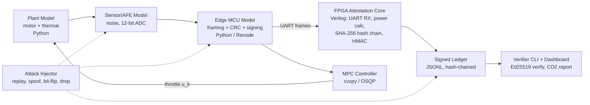

# HRoT Carbon Verification Module: MacBook-Only Blueprint

**Goal:** Prove, entirely in software, that energy savings from a legacy motor can be measured, controlled and cryptographically attested, and that tampering is detected.
**Honest scope:** Simulation proves the *logic, math and attack detection*. It does not prove physical tamper resistance. State this on slide one; it makes you more credible.

---

## 1. Architecture



**Trust boundaries (decide these first):**
- *Secure element (simulated in Python):* holds the per-device Ed25519 key and signs each sensor frame at the source.
- *FPGA core (Verilog):* deterministic power calculation, monotonic counter, SHA-256 hash chain, HMAC tag.
- *MPC:* untrusted. If it is compromised, it can waste energy but cannot forge savings records.
- *Verifier:* uses only the public key.

Why this split: Ed25519 in raw Verilog is heavy and risky for a first build. Software signing plus a Verilog hash chain is realistic and defensible.

---

## 2. Tech Stack

| Layer | Tool | Install |
|---|---|---|
| Language/env | Python 3.12, `uv` | `brew install uv` |
| Plant + sensors | NumPy, SciPy, pandas, python-control | `uv add numpy scipy pandas control` |
| Control (MPC) | cvxpy + OSQP (or do-mpc) | `uv add cvxpy osqp` |
| Baseline / M&V | scikit-learn, statsmodels | `uv add scikit-learn statsmodels` |
| Crypto (software side) | PyNaCl (Ed25519), cryptography | `uv add pynacl cryptography` |
| HDL simulation | Verilator 5 + cocotb | `brew install verilator` / `uv add cocotb` |
| Quick HDL sanity | Icarus Verilog + GTKWave | `brew install icarus-verilog gtkwave` |
| Synthesis / resource count | Yosys (optional nextpnr) | `brew install yosys` |
| Open crypto cores | secworks `sha256`, `aes` (GitHub) | `git clone` into `rtl/third_party/` |
| MCU firmware sim (optional) | Renode | `brew install renode` |
| Dashboard | Streamlit + Plotly | `uv add streamlit plotly` |
| Quality | pytest, ruff, git, GitHub Actions | `uv add --dev pytest ruff` |

Replaces Simulink + Vivado (license-heavy, no native Mac support) with a free, scriptable, CI-friendly stack. cocotb lets Python drive the Verilog directly, which *is* your co-simulation.

**Mac notes:** works on Apple Silicon or Intel. If a brew formula misbehaves, run the HDL tools in a Docker Linux container.

---

## 3. Repo Layout

```
hrot/
  plant/        motor.py, thermal.py, load_profiles.py
  sensors/      afe.py (noise, quantization, jitter), adc.py
  edge/         framing.py (CRC16, counter), secure_element.py (Ed25519)
  rtl/          uart_rx.v, power_calc.v, hash_chain.v, hmac_core.v, top.v
  tb/           cocotb tests (test_uart.py, test_power.py, test_chain.py)
  control/      mpc.py, failsafe.py
  baseline/     regression.py (IPMVP-style), emissions.py
  ledger/       writer.py, verifier.py
  attacks/      replay.py, spoof.py, bitflip.py, drop.py, tamper_ledger.py
  cosim/        run_cosim.py (orchestrates everything)
  dashboard/    app.py
  results/      figures + metrics.json
  docs/         threat_model.md (STRIDE table)
```

---

## 4. Key Design Specs

**Telemetry frame (fixes the 5-bit problem):**
`[SOF 0xA5][counter u32][V u16][I u16][CRC16][...]`
Sampled at 10 kHz+, so you can compute RMS over whole 50 Hz cycles. Delta is derived over each window, not per sample.

**Power math:**
- `Vrms`, `Irms`, real power `P = mean(v·i)` over N whole cycles, `PF = P / (Vrms·Irms)`.
- Start single-phase, then extend to three-phase (sum of phases).
- Fixed-point in Verilog (Q15/Q16). Write a Python golden model first and make the RTL match it bit-for-bit.

**Savings:**
`E_saved = E_baseline(load, temp) − E_measured`
Baseline = regression fitted on a pre-retrofit simulated period. Report with uncertainty (CV(RMSE), confidence interval).

**CO₂:** `kWh_saved × grid_emission_factor(hour)`. Use a synthetic hourly curve at first, then swap in published grid data for your region and cite it.

**Ledger record:**
`{counter, window_start, E_saved, prev_hash, hash, hmac_tag, ed25519_sig}`
Hash chain makes deletion or reordering obvious. A monotonic counter gives replay protection and unique GCM/HMAC nonces.

**MPC:**
State-space `x[k+1] = Ax[k] + Bu[k]`, cost `Σ (e'Qe + u'Ru)` over horizon N_p, constraints on throttle, temperature and torque margin. Failsafe: if the solver fails or output is out of bounds, fall back to the last safe setpoint.

---

## 5. Action Plan (8 Weeks)

**Week 1: Foundations**
- Install the stack, create repo, set up pytest + CI.
- Write `docs/threat_model.md` (STRIDE): assets, attackers, what you do *not* defend against.
- *Done when:* `pytest` passes a hello-world cocotb test.

**Week 2: Plant + sensors**
- Motor model (simple induction/DC motor + thermal state), 3 load profiles (steady, cyclic, bursty).
- AFE model: noise, 12-bit quantization, jitter.
- *Done when:* you can plot clean vs. measured V, I, P and know your measurement error.

**Week 3: Edge framing + signing**
- Frame encoder with CRC16 and counter; simulated secure element signs frames.
- *Done when:* a corrupted or replayed frame is rejected by a Python reference receiver.

**Week 4: Verilog core (part 1)**
- `uart_rx.v`, `power_calc.v` with cocotb tests against the Python golden model.
- *Done when:* RTL output matches golden model within 1 LSB across 1,000 random vectors.

**Week 5: Verilog core (part 2)**
- Hash chain (secworks SHA-256) + HMAC, counter logic, `top.v`.
- Run Yosys for LUT/FF counts.
- *Done when:* the ledger from RTL verifies in `verifier.py`.

**Week 6: Control + baseline**
- MPC in Python with failsafe; regression baseline; CO₂ conversion.
- *Done when:* closed loop saves energy without violating temperature/torque limits, and savings estimate is within a stated % of simulated ground truth.

**Week 7: Attack campaign**
- Run each attack 100+ times: replay, spoofed V/I at sensor (with and without the secure element), bit flips, dropped packets, ledger edits/deletions, compromised MPC.
- *Done when:* detection table is complete, including the attacks you *miss* and why.

**Week 8: Evidence + demo**
- Streamlit dashboard, `metrics.json`, 5-minute screen recording, 10-slide deck, README with one-command reproduction.

---

## 6. Metrics to Report

| Metric | Target |
|---|---|
| Savings estimate error vs. ground truth | < 2-3% |
| Tamper detection rate (per attack class) | reported honestly, aim 100% on in-scope attacks |
| False-reject rate (noise, dropped frames) | < 1% |
| RTL latency per attestation window | stated in cycles |
| FPGA resources (Yosys) | LUTs / FFs / BRAM |
| Control safety | zero temperature/torque violations |

---

## 7. Pitfalls to Avoid

- **Claiming "unspoofable."** Say "spoofing is detected under threat model X."
- Skipping the Python golden model (RTL bugs become undebuggable).
- Putting MPC in Verilog.
- Reusing nonces or hardcoding the baseline.
- Perfect-world sensors; add noise from day one.
- Scope creep: finish single-phase end to end before three-phase.

---

## 8. After the Simulation

Once the metrics are solid, the cheapest hardware step is a ~$30-60 FPGA board (e.g., iCEBreaker, which Yosys/nextpnr supports) plus an ESP32 for the sensor side, reusing the same testbenches.
